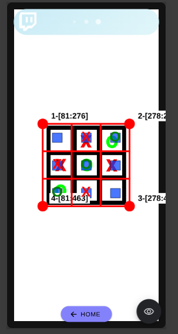

# MORPION-S2

C'est une application de **Morpion (Tic-Tac-Toe)** basée sur la vision par **ordinateur** et l'**intelligence artificielle**.

Le projet permet de jouer au Morpion en utilisant une caméra. Le plateau est détecté automatiquement grâce à **OpenCV**, tandis qu'un modèle d'**intelligence artificielle** entraîné avec **TensorFlow** permet d'identifier le meilleur coup dans les différentes cases du plateau.

---

## Fonctionnement général

1. Jouer contre le modele IA
2. Jouer contre une personne (à l'aide d'un serveur local)
3. Jouer contre autre modele IA (à l'aide d'un serveur local)
4. Laisser le model IA jouer contre une personne ou autre modele IA (à l'aide d'un serveur local)

---

## Modele IA utilisé

On utilise un modele **crée et entrainé** par **Tensorflow / Keras**

## Etape de creation du Modele IA

1. On utilise **Numpy et Pyhon** pour collecter des etats et son meilleur coup selon ma facon de jouer. Ex: pour le plateau vide, je joue souvent la position **2**.

```text
  |   | X
---------
  |   |  
---------
  |   |  
```

2. Apres la collection de tous les etats, on les enregistre sous forme **JSON** dans un fichier.
3. On utilise **Tensorflowjs et Nodejs** pour entrainer notre modele avec **Keras**, en important les données collecté depuis le fichier **JSON**.

## Comment le modèle d’IA interagit-il avec le plateau ?

C'est très simple, on donne le plateau sous `-1`, `0`, `1` et il va repondre avec son meileur coup.

```js
    /**
     * -1 pour O
     * 0 pour case vide
     * 1 pour X
     */
    [0, 0, 1, 0, -1, 0, 0, 0, 0]
```

```js
    // La réponse sera l’index correspondant à la probabilité la plus élevée
    6
```

## Détection du plateau avec OpenCV

**OpenCV** est utilisé pour traiter l'image provenant de la caméra.

Le traitement permet notamment de :

* récupérer l'image de la caméra
* effectuer des opérations de traitement d'image
* détecter le maximum contour d'un carre noir

```text
1─────────────────2
│                 │
│                 │
│                 │
│                 │
│                 │
4─────────────────3
```

* identifier la zone correspondant au plateau:
    - on divise par 3 tous les côtés(`1-2`, `2-3`, `3-4`et `4-1`)
    - identifier la valeur du pixel present dans chaque case (`rouge` pour X et `vert` pour O)

    

    - transformer le plateau obtenue en Array de type `(-1, 0, 1)[]`

* Le plateau est ensuite considéré comme une grille de:

```js
    [0, 1, -1, 1, -1, 1, -1, 1, 0]
```

---

## Serveur

Le serveur utilise également un serveur basé sur :

* **Node.js**
* **Express**
* **Socket.IO**

---

## Technologies utilisées du partie Entrainement

| Technologie    | Utilisation
| -------------- | -------------------------------------
| Google Colab   | VM gratuit enligne
| Python / Numpy | Collection des données
| Node.js        | Runtime d'execution javascript
| tfjs-node      | Creation et entrainement du modele IA

## Technologies utilisées du partie Application

| Technologie    | Utilisation
| -------------- | -------------------------------------
| Ionic          | pour gagner du temps en utilisant les composants pre-definit
| Angular        | pour structurer le projet vers POO et securiser avec le typage des données
| Capacitor      | Accès aux fonctionnalités natives et construire une fichier executable sur mobile (ios ou android)
| OpenCV         | Traitement et détection d'image
| TensorFlowJs   | moteur d'execution du modele IA
| Socket.IO      | Communication temps réel

---

## DEMO

### 1. Tester sur android

Le Fichier apk est dans [`android/app/build/outputs/apk/debug/`](android/app/build/outputs/apk/debug/)

### 2. Jouer contre le modele IA


### 3. Jouer contre une personne


### 4. Jouer contre autre modele IA


### 5. Laisser le model IA jouer contre une personne ou autre modele IA

## Lien utiles

- Etapes de creation des etats et mes meilleurs coup: [`github.com/selestinohajaniaina/IASE/blob/master/MY_MODEL.ipynb`](https://github.com/selestinohajaniaina/IASE/blob/master/MY_MODEL.ipynb)

- Entrainement du model IA avec node.js: [`github.com/selestinohajaniaina/IASE/blob/master/build.js`](https://github.com/selestinohajaniaina/IASE/blob/master/build.js)

- Modele IA obtenue: [`github.com/selestinohajaniaina/IASE/tree/master/morpion-model`](https://github.com/selestinohajaniaina/IASE/tree/master/morpion-model)